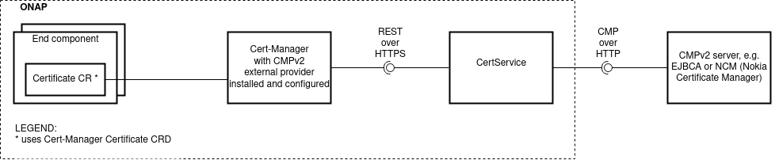
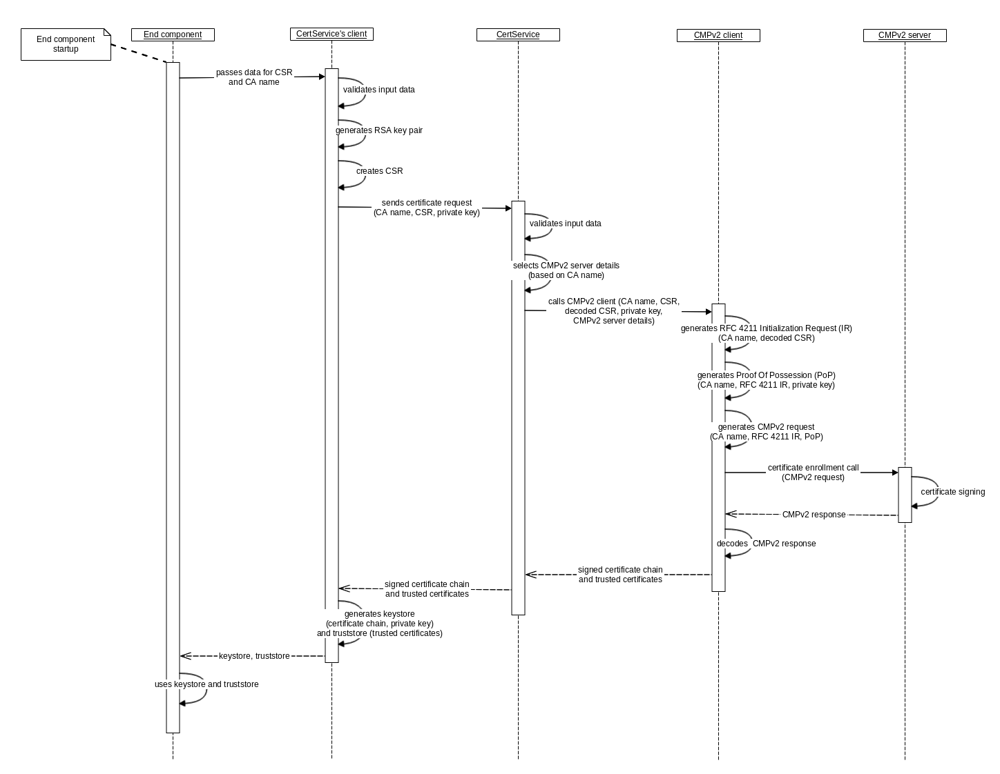

.. This work is licensed under a Creative Commons Attribution 4.0 International License.
.. http://creativecommons.org/licenses/by/4.0
.. Copyright 2020 NOKIA
.. _architecture:

Architecture
============

Interaction between components
------------------------------

Simplified certificate enrollment flow
--------------------------------------

Security considerations
-----------------------

CertService's REST API is protected by mutual HTTPS, meaning server requests client's certificate and **authenticate** only requests with trusted certificate. After ONAP default installation only certificate from CertService's client is trusted. **Authorization** isn't supported in Frankfurt release.