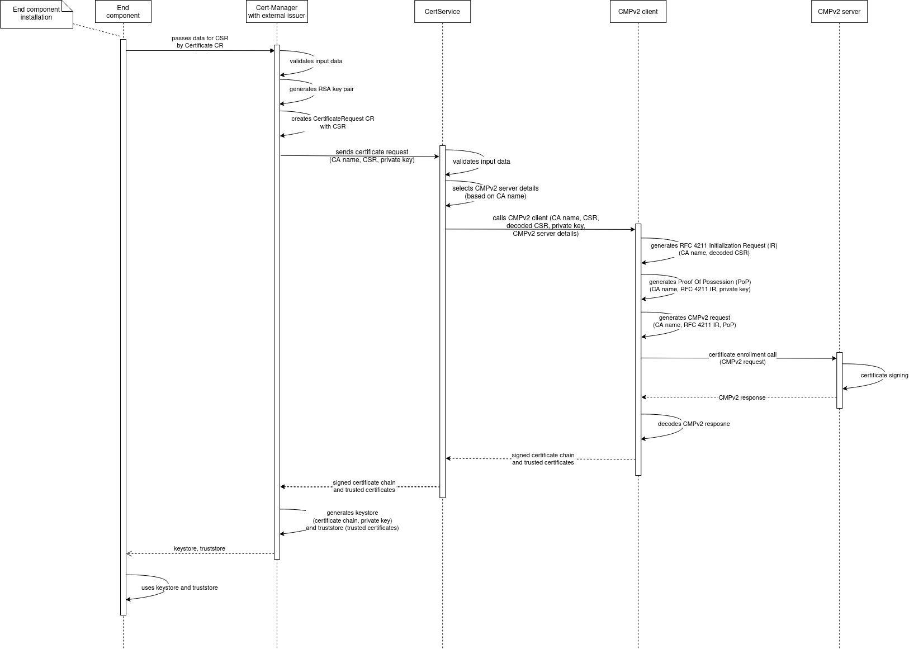

.. This work is licensed under a Creative Commons Attribution 4.0 International License.
.. http://creativecommons.org/licenses/by/4.0
.. Copyright 2020 NOKIA
.. _architecture:

Architecture
============

Interaction between components
------------------------------

.. image:: resources/certservice_high_level.png
   :width: 978px
   :height: 201px
   :alt: Interaction between components

The micro-service called CertService is designed for requesting certificates signed by external Certificate Authority (CA) using CMP over HTTP protocol. It uses CMPv2 client to send and receive CMPv2 messages.

External issuer is also provided so other ONAP components (aka end components) can easily get certificate from CertService. End component is an ONAP component (e.g. DCAE collector or controller) which requires certificate from CMPv2 server to protect external traffic and uses Certificate CR to get it.

External issuer communicates with CertService via REST API over HTTPS, while CertService with CMPv2 server via CMP over HTTP.

To proof that CertService works Open Source CMPv2 server (EJBCA) is deployed and used in E2E tests.

Simplified certificate enrollment flow
--------------------------------------

