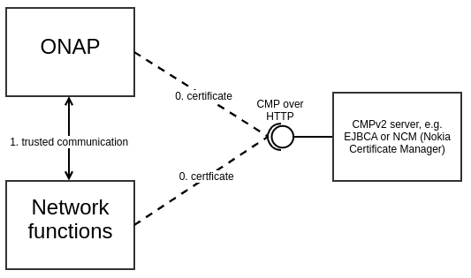

.. This work is licensed under a Creative Commons Attribution 4.0 International License.
.. http://creativecommons.org/licenses/by/4.0
.. Copyright 2020 NOKIA
.. _introduction:

Introduction
=============

Overview
--------

In Frankfurt release AAF was enhanced by Certificate Management Protocol ver. 2 (CMPv2) support. Such support is handled by new AAF's microservice called CertService. CertService provides certificates signed by external CMPv2 server - further on such certificates are called operators certificates. Operators certificates are meant to secure external ONAP traffic - traffic between network functions (xNFs) and ONAP.

In Guilin release CertService was moved from AAF repository to OOM repository.

Context View
------------

It is planned that Network Functions (aka xNFs) will get certificates from the same CMPv2 server and the same CA hierarchy, but will use own means to get such certificates. Cause xNFs and ONAP will get certificates signed by the same root CA and will trust such root CA, both parties will automatically trust each other and can communicate with each other.

Functionality
-------------

In Frankfurt release only `Initialization Request <https://tools.ietf.org/html/rfc4210#section-5.3.1>`_ with `ImplicitConfirm <https://tools.ietf.org/html/rfc4210#section-5.1.1.1>`_ is supported.

Request sent to CMPv2 server is authenticated by secret value (initial authentication key) and reference value (used to identify the secret value) as described in `RFC-4210 <https://tools.ietf.org/html/rfc4210#section-4.2.1.2>`_.

Security considerations
-----------------------

CertService's REST API is protected by mutual HTTPS, meaning server requests client's certificate and **authenticate** only requests with trusted certificate. After ONAP default installation only certificate from CertService's client is trusted. **Authorization** isn't supported in Frankfurt release.